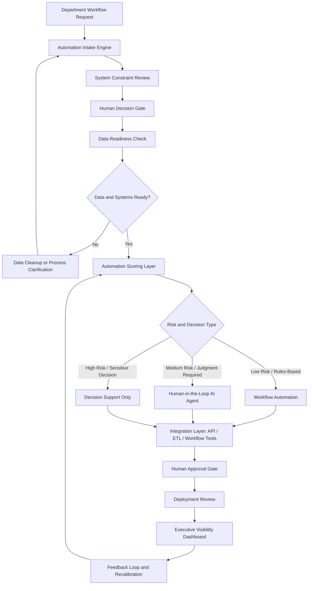
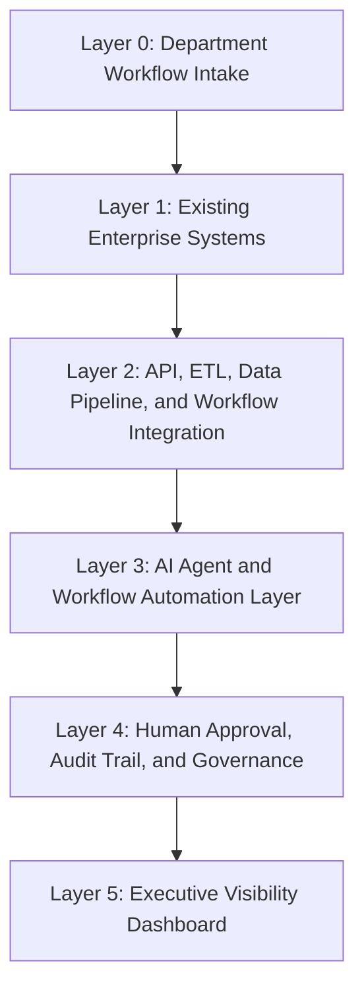
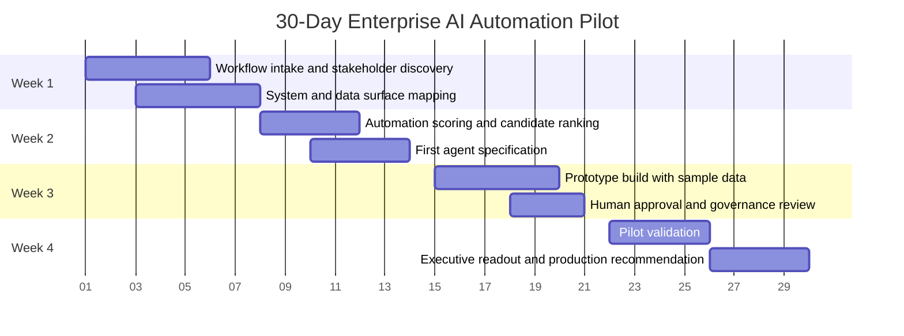

<p align="center">
  
  
  
</p>

<p align="center">
  
  
  
  
</p>

# Enterprise AI Automation Command Center

## Mock Solution Architecture for a First Enterprise AI Function

This repository presents a role-fit solution architecture for standing up an enterprise AI automation function across finance, accounting, legal, and corporate operations.

It is designed for companies that are past AI curiosity but not yet at AI operating maturity. These organizations usually do not need another chatbot demonstration. They need a governed intake, scoring, integration, and deployment layer that turns manual back-office work into production-grade automation without ripping out existing enterprise systems.

The core question this architecture answers is simple:

> How should a company identify, prioritize, govern, and deploy AI automation across back-office functions when the current work lives across spreadsheets, email, PDFs, approvals, ERP exports, ticketing tools, and disconnected reporting processes?

---

## Executive Summary

Most enterprises do not fail at AI because the model is weak.

They fail because the operating layer around the model is missing.

Finance, accounting, legal, and corporate operations often depend on manual spreadsheets, recurring reporting tasks, approval handoffs, contract intake queues, disconnected data extracts, and status updates that live in email threads. The automation opportunity sits in the work between systems.

This architecture creates a repeatable path from manual workflow to governed AI automation:

1. Capture automation candidates from departments.
2. Score each workflow for value, feasibility, risk, data readiness, and governance needs.
3. Route the workflow to the correct automation path.
4. Integrate with existing systems using APIs, ETL, workflow tools, and human approval gates.
5. Provide senior leadership with visibility into automation pipeline status, value delivered, and operational risk.

This is not a rip-and-replace strategy. It is an enterprise AI operating model built to sit above existing systems and improve the work they already support.

---

## Business Problem

Back-office teams frequently rely on a fragmented operating environment:

- Finance reporting assembled from recurring spreadsheet exports
- Accounting close tasks tracked across email, spreadsheets, and status calls
- Legal requests routed manually with inconsistent intake quality
- Contract review dependent on ad hoc summaries and missing-document follow-up
- Corporate operations requests lacking consistent triage, ownership, and escalation
- Manual reporting cycles that consume time but do not produce better decisions

The problem is not only inefficiency.

The deeper issue is that leadership often lacks a clear view of:

- Which workflows are automation-ready
- Which workflows require data cleanup first
- Which workflows are too sensitive for full automation
- Which decisions require human approval
- Which automations are producing measurable value
- Which pilots should graduate into production

This architecture is built to close that gap.

---

## Solution Overview

The Enterprise AI Automation Command Center is a conceptual architecture for managing the full automation lifecycle.

It includes six operating layers:

| Layer | Component | Purpose |
|---|---|---|
| 0 | Department Workflow Intake | Captures candidate workflows from finance, accounting, legal, and operations |
| 1 | System Constraint Review | Maps technical, operational, human, and organizational constraints before recommending automation |
| 2 | Human Decision Gate | Determines whether AI belongs in the workflow and where human approval is required |
| 3 | Automation Scoring Layer | Scores impact, feasibility, data readiness, risk, and integration complexity |
| 4 | AI Agent and Workflow Layer | Routes candidates to AI agents, workflow automation, decision support, or data cleanup |
| 5 | Executive Visibility Dashboard | Shows pipeline status, deployed automations, blocked workflows, value delivered, and next priorities |

The design principle is disciplined:

> AI should improve real decisions and reduce real operational friction. If it only creates reports no one acts on, it is not production automation.

---

## Repository Architecture

Recommended structure for this repo:

```text
enterprise-ai-automation-command-center/
|
|-- README.md
|-- index.html
|
|-- docs/
|   |-- solution-architecture.md
|   |-- workflow-diagram.md
|   |-- agent-specs.md
|   |-- governance-model.md
|   |-- 30-day-implementation-plan.md
|
|-- assets/
|   |-- architecture-diagram.png
|   |-- dashboard-preview.png
|
|-- data/
|   |-- sample-automation-candidates.json
```

### Public GitHub Pages Entry Point

The `index.html` file should act as the executive-facing artifact.

It should present:

- The business problem
- The operating model
- The workflow architecture
- The automation scoring matrix
- Example AI agent concepts
- The governance model
- A 30-day implementation sequence

The README should serve as the more technical architecture explanation for recruiters, hiring managers, and technical stakeholders who want to see how the page maps to a real enterprise implementation model.

---

## Architecture Workflow



---

## Layered Architecture



### Layer 0: Department Workflow Intake

Captures workflow candidates from finance, accounting, legal, and corporate operations.

Example intake fields:

- Department
- Workflow name
- Current process
- Systems involved
- Manual hours per week
- Spreadsheet dependency
- Error risk
- Approval requirement
- Data sensitivity
- Business impact
- Current owner

### Layer 1: Existing Enterprise Systems

The architecture assumes the organization already has systems that matter.

Examples:

- ERP or accounting platform
- Contract repository
- Shared drives
- Email
- Excel or spreadsheet workflows
- SQL databases
- Ticketing systems
- Vendor management tools
- Reporting dashboards

The strategy is not to replace these systems first. The strategy is to integrate with them where possible and reduce the manual work between them.

### Layer 2: API, ETL, Data Pipeline, and Workflow Integration

This layer connects existing systems to automation workflows.

It may include:

- API-based retrieval
- Scheduled data extracts
- ETL or ELT workflows
- SQL transformations
- Power Automate or workflow orchestration
- File parsing
- Document ingestion
- Structured status updates
- Exception routing

### Layer 3: AI Agent and Workflow Automation Layer

This layer converts approved use cases into operating tools.

Automation types:

- Rules-based workflow automation
- Human-in-the-loop AI agent
- Decision-support assistant
- Reporting summarization agent
- Intake triage agent
- Exception detection workflow
- Spreadsheet replacement pipeline

### Layer 4: Human Approval, Audit Trail, and Governance

Every consequential workflow needs a named human owner.

This layer defines:

- Approval authority
- Escalation path
- Human override criteria
- Audit trail requirements
- Data sensitivity level
- Failure definition
- Production readiness threshold

### Layer 5: Executive Visibility Dashboard

Leadership needs to see more than automation activity.

They need to see automation value.

Dashboard views:

- Automation candidates submitted
- Active pilots
- Deployed automations
- Blocked workflows
- Estimated hours saved
- Manual spreadsheet reduction
- Risk classification
- Pending approvals
- Department adoption
- Next 30-day deployment candidates

---

## Automation Candidate Scoring Model

Each workflow is scored before any build recommendation is made.

| Scoring Dimension | Question |
|---|---|
| Business Impact | Does this workflow materially improve cost, speed, quality, risk, or executive visibility? |
| Manual Effort Reduction | Does this remove repeated manual work or spreadsheet dependency? |
| Data Readiness | Is the required data structured, accessible, and reliable enough to support automation? |
| Integration Complexity | How difficult is the API, ETL, workflow, or system connection path? |
| Risk Level | Could automation create legal, financial, compliance, or operational harm? |
| Human Approval Need | Does the workflow require human judgment before execution? |
| Deployment Feasibility | Can this be prototyped and validated within a reasonable pilot window? |
| Executive Visibility | Would leadership care if this workflow improved? |

### Recommendation Bands

| Verdict | Meaning |
|---|---|
| Automate Now | High value, low-to-moderate risk, data ready, clear owner |
| Prototype First | Strong candidate, but needs controlled pilot validation |
| Human-in-the-Loop | AI can assist, but human approval remains required |
| Decision Support Only | AI can summarize or recommend, but should not execute |
| Needs Data Cleanup | Workflow is not automation-ready until data/process issues are fixed |
| Do Not Automate Yet | Risk, ambiguity, or poor fit makes automation premature |

---

## Example Back-Office Use Cases

### Finance Reporting Agent

Purpose:

Generate recurring leadership reporting summaries from approved data sources.

Potential capabilities:

- Pull recurring reports
- Summarize variance drivers
- Flag missing inputs
- Draft executive commentary
- Route final report for finance approval

Human approval:

Finance leadership approves final commentary before distribution.

### Accounting Close Assistant

Purpose:

Improve close-cycle visibility and reduce status-chasing.

Potential capabilities:

- Track close tasks
- Flag missing reconciliations
- Identify blockers
- Summarize close status
- Escalate late items to the correct owner

Human approval:

Accounting leadership owns close certification.

### Legal Intake Agent

Purpose:

Standardize legal request intake and reduce incomplete handoffs.

Potential capabilities:

- Summarize contract requests
- Extract key terms
- Identify missing documents
- Classify request type
- Route to legal review

Human approval:

Legal team approves all legal interpretations, redlines, and final positions.

### Spreadsheet Replacement Pipeline

Purpose:

Convert recurring manual spreadsheet workflows into structured data pipelines and dashboards.

Potential capabilities:

- Identify recurring spreadsheet dependencies
- Map source systems
- Extract and normalize data
- Create repeatable reporting flow
- Reduce manual copy/paste effort

Human approval:

Business owner validates output accuracy before deployment.

### Corporate Operations Triage Agent

Purpose:

Improve routing, ownership, and visibility across corporate operations requests.

Potential capabilities:

- Classify incoming requests
- Assign owners
- Track status
- Flag stalled items
- Summarize operational bottlenecks for leadership

Human approval:

Operations leader owns prioritization and escalation decisions.

---

## Governance Principles

This architecture assumes that enterprise AI should be useful, but constrained.

Core principles:

1. AI recommends. Humans approve consequential decisions.
2. Existing systems remain the system of record unless explicitly changed.
3. Every automation has a named owner.
4. Every production workflow has a failure definition.
5. Sensitive workflows require audit trails.
6. Data readiness determines automation readiness.
7. If no one acts on the output, it is not an automation priority.
8. Pilot before production.
9. Do not optimize a workflow that should not exist.
10. Do not automate ambiguity.

---

## Production Readiness Checklist

Before a workflow moves from prototype to production:

- [ ] Named business owner assigned
- [ ] Data source confirmed
- [ ] Integration path identified
- [ ] Human approval gate defined
- [ ] Failure condition documented
- [ ] Audit trail requirement documented
- [ ] Security and access boundaries reviewed
- [ ] Test cases completed
- [ ] Pilot users identified
- [ ] Executive reporting metric defined
- [ ] Feedback loop established

---

## 30-Day Implementation Plan



### Week 1: Workflow Discovery and System Mapping

Outputs:

- Department workflow inventory
- Manual spreadsheet dependency map
- Existing systems map
- Candidate automation backlog

### Week 2: Scoring and First Agent Specification

Outputs:

- Automation scoring matrix
- First use case selection
- Agent specification
- Human approval model

### Week 3: Prototype and Governance Review

Outputs:

- Prototype workflow
- Sample-data validation
- Risk classification
- Pilot acceptance criteria

### Week 4: Pilot and Executive Readout

Outputs:

- Pilot results
- Value estimate
- Production readiness verdict
- Next 30-day roadmap

---

## Example Automation Candidate Matrix

| Candidate | Department | Impact | Feasibility | Risk | Data Readiness | Recommendation |
|---|---|---:|---:|---:|---:|---|
| Monthly finance reporting summary | Finance | High | Medium | Medium | Medium | Prototype First |
| Close-cycle task tracker | Accounting | High | High | Medium | High | Automate Now |
| Contract intake summarizer | Legal | Medium | High | High | Medium | Human-in-the-Loop |
| Vendor onboarding checklist | Operations | Medium | High | Low | High | Automate Now |
| Manual spreadsheet consolidation | Finance / Ops | High | Medium | Medium | Low | Needs Data Cleanup |
| Executive status digest | Corporate Ops | Medium | High | Low | High | Automate Now |

---

## What This Demonstrates

This repository is designed to demonstrate the ability to:

- Translate ambiguous executive AI goals into a workable operating model
- Think across finance, accounting, legal, and corporate operations
- Design AI workflows around existing enterprise systems
- Separate automation candidates from AI theater
- Build human-in-the-loop governance into agent workflows
- Map API, ETL, reporting, and workflow integration requirements
- Communicate technical architecture in executive language
- Move from idea to prototype sequence without overbuilding

---

## Suggested GitHub Pages Positioning

The public page should be described as:

> A mock operating model for standing up a first enterprise AI automation function across finance, accounting, legal, and corporate operations.

Recommended page title:

```text
Enterprise AI Automation Command Center
```

Recommended subtitle:

```text
A solution architecture for identifying, scoring, governing, and deploying back-office AI automation without ripping out existing systems.
```

---

## Disclaimer

This repository is a mock solution architecture and portfolio artifact. It does not contain confidential client data, employer data, proprietary system access, or production credentials.

All examples are illustrative and intended to demonstrate architecture thinking, workflow design, automation prioritization, and executive communication.

---

## Author

**Erwin Maurice McDonald**  
AI Solutions Architect | Enterprise Systems Analyst | GTM Intelligence | Prompt and Context Engineering  
Fort Worth, Texas  

GitHub: [github.com/emcdo411](https://github.com/emcdo411)  
LinkedIn: [linkedin.com/in/mauricemcdonald](https://www.linkedin.com/in/mauricemcdonald)
