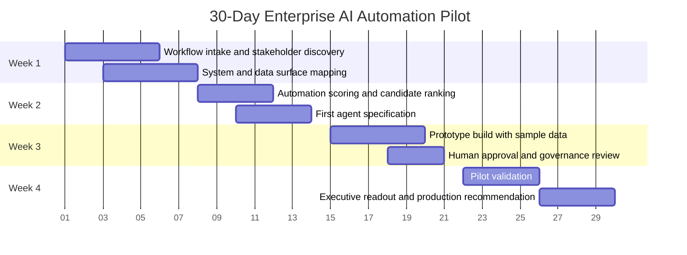

# 30-Day Implementation Plan

## Purpose

This plan outlines a practical 30-day path for launching the first enterprise AI automation pilot across finance, accounting, legal, or corporate operations.

The objective is not to automate everything in 30 days.

The objective is to prove a repeatable operating model:

1. Capture workflow candidates.
2. Score them.
3. Select the best first use case.
4. Build a controlled prototype.
5. Validate with users.
6. Deliver an executive readout with a production recommendation.

## 30-Day Pilot Timeline



## Week 1: Workflow Discovery and System Mapping

### Objective

Understand how work actually happens before recommending automation.

### Activities

- Meet with finance, accounting, legal, and operations stakeholders.
- Identify recurring manual workflows.
- Map spreadsheet dependencies.
- Identify systems of record.
- Capture pain points, delays, and error risks.
- Document approval paths.
- Identify candidate workflows for scoring.

### Outputs

- Workflow inventory
- Stakeholder map
- Current-state process map
- Systems and data surface map
- Candidate automation backlog

### Key Questions

- What recurring work consumes the most manual effort?
- Which spreadsheet workflows are mission-critical?
- Where do approvals stall?
- Which reports are built manually every week or month?
- Which workflows have clear rules?
- Which workflows require judgment?
- Who owns the final decision?

## Week 2: Scoring and First Agent Specification

### Objective

Select the first automation candidate based on impact, feasibility, risk, and readiness.

### Activities

- Score candidate workflows.
- Separate automation-ready workflows from data-cleanup workflows.
- Select the first pilot use case.
- Write the agent specification.
- Define human approval rules.
- Define acceptance criteria.
- Confirm data access path.

### Outputs

- Automation scoring matrix
- First use case recommendation
- Agent specification
- Governance requirements
- Acceptance criteria

### Decision Gate

At the end of Week 2, leadership should know:

- Which workflow is being prototyped
- Why it was selected
- What the AI can and cannot do
- Who owns approval
- What success looks like

## Week 3: Prototype and Governance Review

### Objective

Build a controlled prototype using sample or approved data.

### Activities

- Build first workflow prototype.
- Test against sample inputs.
- Validate output quality with business owner.
- Review approval paths.
- Identify failure modes.
- Document audit trail requirements.
- Adjust workflow based on user feedback.

### Outputs

- Working prototype
- Test results
- Output examples
- Governance review notes
- Failure definition
- Pilot validation plan

### Prototype Rules

- Use safe data where possible.
- Mark all AI output as draft.
- Route consequential outputs to human review.
- Log test cases.
- Capture user feedback.
- Do not move into production until approval criteria are met.

## Week 4: Pilot Validation and Executive Readout

### Objective

Validate whether the prototype should become a production workflow.

### Activities

- Run pilot with approved users.
- Capture time saved or friction reduced.
- Track output accuracy.
- Track human overrides.
- Identify integration gaps.
- Produce executive readout.
- Recommend production, redesign, or hold.

### Outputs

- Pilot results
- Adoption feedback
- Value estimate
- Risk assessment
- Production readiness verdict
- Next 30-day roadmap

## Executive Readout Format

The final readout should include:

1. Workflow selected
2. Why it was selected
3. Prototype summary
4. Results
5. User feedback
6. Risk and governance notes
7. Production readiness verdict
8. Next implementation step

## Success Metrics

Potential pilot metrics:

- Manual hours reduced
- Number of spreadsheet steps removed
- Cycle time reduction
- Error reduction
- Time to executive report draft
- Number of requests routed correctly
- User approval rate
- Override frequency
- Blockers identified
- Production readiness score

## Final Verdict Options

| Verdict | Meaning |
|---|---|
| Move to Production | Prototype passed value, risk, and governance checks |
| Extend Pilot | Value exists but more testing is required |
| Redesign | Workflow has value but implementation path needs adjustment |
| Data Cleanup First | Automation blocked by source quality or access |
| Do Not Automate Yet | Risk, ambiguity, or poor workflow fit is too high |

## Bottom Line

The first 30 days should create more than a prototype.

It should create the operating pattern for the enterprise AI function:

```text
Find the workflow.
Score the opportunity.
Define the human gate.
Build the prototype.
Validate the result.
Report the value.
Decide the next deployment.
```

