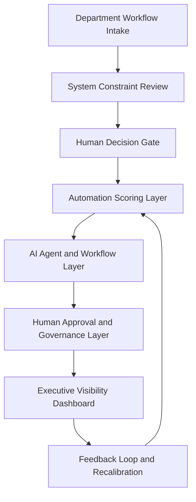

# Solution Architecture

## Enterprise AI Automation Command Center

This document defines the solution architecture for a first enterprise AI automation function serving finance, accounting, legal, and corporate operations.

The goal is not to replace enterprise systems. The goal is to create an automation operating layer above the systems already in place.

## Architecture Thesis

Most back-office automation opportunities live between systems:

- Spreadsheet exports
- Email approvals
- PDF attachments
- ERP reports
- Contract requests
- Manual status updates
- Department-specific workarounds

The architecture should not begin with a model. It should begin with the workflow.

```text
Workflow first.
System context second.
AI fit third.
Automation last.
```

## Core Design Principles

1. Existing systems remain the system of record unless explicitly changed.
2. AI is introduced only where it improves a real decision, reduces operational friction, or creates measurable reporting value.
3. Human approval remains required for consequential finance, accounting, legal, and compliance decisions.
4. Every automation must have a named owner, a failure definition, and an audit trail requirement.
5. Data readiness determines automation readiness.
6. A prototype must prove value before production deployment.

## Logical Architecture



## Component Model

| Component | Purpose | Output |
|---|---|---|
| Department Workflow Intake | Captures automation candidates from business teams | Candidate workflow profile |
| System Constraint Review | Maps technical, operational, human, and organizational constraints | Stable / Conditional / Fragile environment read |
| Human Decision Gate | Determines whether AI belongs in the workflow | PASS / CONDITIONAL / FAIL |
| Data Readiness Check | Evaluates source quality, access, structure, and reliability | Data readiness score |
| Automation Scoring Layer | Scores business impact, feasibility, risk, and integration complexity | Automation recommendation |
| AI Agent Layer | Executes approved agent or workflow concepts | Draft output, summary, routing, exception flag |
| Human Approval Layer | Preserves accountable human judgment | Approval, override, escalation |
| Executive Dashboard | Shows value, progress, blocked workflows, and risk | Leadership visibility |

## Existing Systems Layer

The architecture assumes a mixed enterprise environment.

Potential system inputs:

- ERP or accounting system
- Excel and spreadsheet workflows
- Email and shared inboxes
- SharePoint / OneDrive / shared drives
- Contract repository
- SQL databases
- Ticketing or workflow tools
- Vendor management systems
- Reporting dashboards

## Integration Layer

The integration layer connects existing systems to automation workflows.

Potential integration methods:

- APIs
- ETL or ELT pipelines
- Scheduled file drops
- SQL queries
- Workflow automation tools
- Document parsing
- Email ingestion
- Human-entered intake forms

## AI Agent Layer

The AI agent layer should be designed by workflow type.

| Workflow Type | Recommended AI Pattern |
|---|---|
| Repetitive rules-based task | Workflow automation |
| Document intake and summary | Human-in-the-loop AI agent |
| Sensitive legal or financial analysis | Decision support only |
| Reporting assembly | Reporting automation plus human approval |
| Status tracking | Workflow automation and exception detection |
| Ambiguous or high-risk decision | Do not automate yet |

## Governance Layer

Every production workflow should define:

- Named business owner
- Data owner
- Technical owner
- Approval threshold
- Escalation path
- Audit trail requirement
- Failure definition
- Human override procedure
- Recalibration cadence

## Executive Visibility Layer

Leadership needs to know:

- What is being automated
- Why it was prioritized
- Who owns it
- What risk category it carries
- Whether the workflow is blocked
- How much value it is producing
- Whether it is ready for production

## Architecture Verdict

The correct architecture is not a single AI agent. It is a governed automation pipeline.

The enterprise AI function should become the operating layer that receives workflow demand, scores it, routes it, governs it, and shows leadership what is working.

