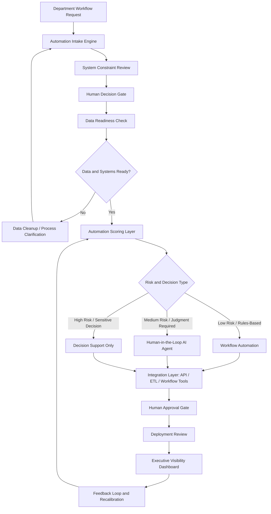

# Workflow Diagram

## Enterprise AI Automation Lifecycle

This workflow shows how a back-office automation opportunity moves from department request to governed deployment.

## Workflow Stages

### 1. Department Workflow Request

A business team submits a candidate workflow.

Examples:

- Monthly finance reporting
- Accounting close task tracking
- Contract intake routing
- Vendor onboarding checklist
- Manual spreadsheet consolidation
- Executive status digest

### 2. Automation Intake Engine

The intake engine captures the information needed to evaluate the workflow.

Required fields:

- Department
- Workflow name
- Current owner
- Current process
- Systems involved
- Spreadsheet dependency
- Manual effort estimate
- Error or delay risk
- Approval requirement
- Data sensitivity
- Business impact

### 3. System Constraint Review

This stage maps whether the current environment can support automation.

Constraint categories:

- Technical reality
- Operational reality
- Human reality
- Organizational reality

Environment classifications:

| Classification | Meaning |
|---|---|
| Stable | Automation can proceed with normal implementation controls |
| Conditional | Automation is possible after targeted redesign or clarification |
| Fragile | Automation should not proceed until the system is stabilized |

### 4. Human Decision Gate

This stage determines whether AI belongs in the workflow.

Gate questions:

- Does this improve a real decision?
- Does it match how operators actually work?
- Does it reduce friction?
- Would users trust the output?
- Would removing it make the workflow worse?

Verdicts:

- PASS
- CONDITIONAL
- FAIL

### 5. Data Readiness Check

This stage checks whether the data can support automation.

Common blockers:

- Data lives only in spreadsheets
- Source fields are inconsistent
- Process rules are undocumented
- System access is unclear
- No owner can validate output accuracy
- Historical data is incomplete

### 6. Automation Scoring Layer

Scoring dimensions:

- Business impact
- Manual effort reduction
- Data readiness
- Integration complexity
- Risk level
- Human approval need
- Deployment feasibility
- Executive visibility

### 7. Automation Routing

The workflow is routed into the correct implementation path:

| Route | When Used |
|---|---|
| Workflow Automation | Low-risk, rules-based, repeatable process |
| Human-in-the-Loop AI Agent | AI can assist but human judgment remains required |
| Decision Support Only | Sensitive workflow where AI should summarize or recommend only |
| Data Cleanup | Workflow is promising but not ready |
| Do Not Automate Yet | Risk or ambiguity outweighs expected value |

### 8. Deployment Review

Before deployment, the workflow must have:

- Named owner
- Acceptance criteria
- Test cases
- Approval path
- Failure definition
- Audit trail
- Pilot user group
- Recalibration plan

### 9. Executive Visibility Dashboard

The dashboard shows leadership:

- Candidate workflows
- Pilot status
- Production status
- Blockers
- Risk level
- Estimated value
- Owner
- Next decision

### 10. Feedback Loop and Recalibration

Automation is not finished at deployment.

Production workflows should be reviewed for:

- Accuracy
- Adoption
- Time saved
- Error reduction
- User trust
- Escalation frequency
- Override patterns
- Criteria drift

